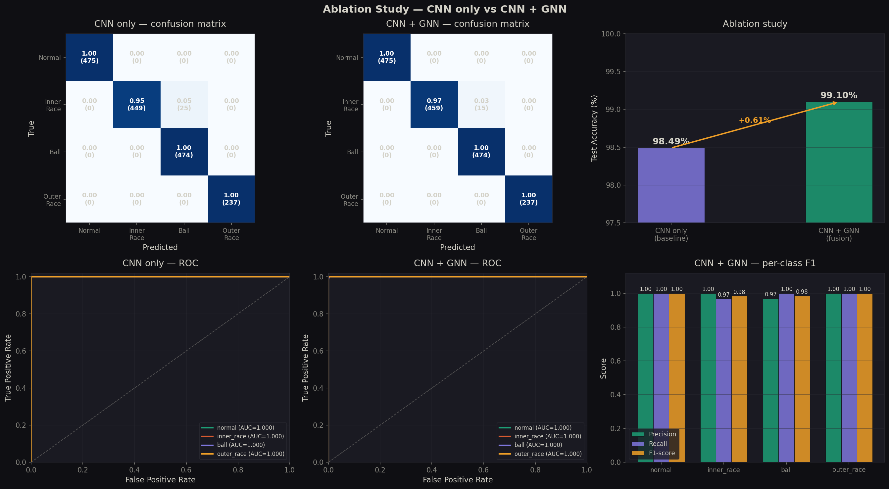

# Industrial GNN Predictive Maintenance

<p align="center">
  
  
  
  
  
</p>

<p align="center">
  Bearing fault detection via <strong>multimodal fusion</strong> of vibration signal encoding (1D-CNN) and equipment graph context (GraphSAGE GNN) — benchmarked on the CWRU dataset with a rigorous ablation study.
</p>

---

## Motivation

Most predictive maintenance models treat each machine in isolation. In real industrial environments, machines are mechanically connected — a degrading motor bearing stresses adjacent pump bearings through the shared shaft. A standard CNN sees one signal. It cannot reason about the factory topology.

This project models the factory as a **graph** where nodes are bearings and edges are mechanical connections. By fusing signal-level features (CNN) with graph-structural context (GNN), we show a measurable improvement over the signal-only baseline — and prove it with a controlled ablation.

---

## Results




| Model | Architecture | Test Accuracy | Params |
|-------|-------------|:-------------:|-------:|
| Baseline | 1D-CNN only | 98.49% | 689K |
| **Full model** | **1D-CNN + GraphSAGE fusion** | **99.10%** | **805K** |
| Δ improvement | Graph context added | **+0.61%** | — |

> **Note on the baseline:** A naive window-level split gives 100% accuracy due to data leakage (overlapping windows from the same file appear in both train and test). We use a **file-level split** — all windows from a given `.mat` file stay in one split only. The 98.49% baseline is the honest, leak-free number.

---

## Architecture

```
┌─────────────────────────────────────────────────────────────────┐
│                        Input                                    │
│                                                                 │
│   Vibration signal          Equipment graph                     │
│   (batch, 1, 1024)          20 nodes · 90 edges                │
└──────────┬──────────────────────────┬──────────────────────────┘
           │                          │
           ▼                          ▼
┌──────────────────┐       ┌──────────────────────┐
│  Temporal        │       │  Graph Encoder        │
│  Encoder         │       │  GraphSAGE · 2 layers │
│  1D-CNN          │       │  node_feat(6) → 128   │
│  4 stages + res  │       └──────────┬────────────┘
│  (1,1024)→128    │                  │ look up node embedding
└──────────┬───────┘                  │ per sample
           │                          │
           └──────────┬───────────────┘
                      ▼
           ┌──────────────────────┐
           │  Gated Fusion        │
           │  concat(128+128)=256 │
           │  sigmoid gate · MLP  │
           └──────────┬───────────┘
                      ▼
           ┌──────────────────────┐
           │  Prediction Head     │
           │  4 fault classes     │
           └──────────────────────┘
```

### Equipment graph construction

The graph is built from domain knowledge of bearing mechanics:

| Edge type | Rule | Weight |
|-----------|------|--------|
| Severity propagation | Same fault type, adjacent severity (7→14→21 mil) | 0.8–1.0 |
| Shared shaft | Same load condition, same severity, different fault type | 0.8 |
| Baseline reference | Normal node → fault node at same load | 0.5 |

---

## Dataset

**[CWRU Bearing Fault Dataset](https://engineering.case.edu/bearingdatacenter)** — the standard industrial fault detection benchmark from Case Western Reserve University.

- Signals recorded at **12 kHz**, drive-end accelerometer
- Motor speed: **1797 RPM**
- Each window: **1024 samples** (~85ms), **50% overlap**
- Per-window normalization: zero mean, unit variance

| Label | Class | Description | Files |
|-------|-------|-------------|-------|
| 0 | Normal | Healthy bearing | 4 |
| 1 | Inner race | Crack on inner ring | 6 |
| 2 | Ball | Defect on rolling element | 6 |
| 3 | Outer race | Crack on outer ring | 4 |

**Total:** 20 `.mat` files · 6,622 windows · file-level 60/20/20 split

---

## Project Structure

```
industrial-gnn-predictive-maintenance/
│
├── src/
│   ├── data/
│   │   ├── cwru_dataset_v2.py      # File-level split dataset (no leakage)
│   │   ├── cwru_dataset.py         # Original dataset (for reference)
│   │   └── graph_builder.py        # Equipment graph construction
│   │
│   ├── models/
│   │   ├── temporal_encoder.py     # 1D-CNN encoder + standalone classifier
│   │   ├── gnn_encoder.py          # GraphSAGE encoder
│   │   └── fusion_model.py         # Gated CNN+GNN fusion model
│   │
│   └── train/
│       ├── train_baseline_v2.py    # Ablation A: CNN only (98.49%)
│       └── train_fusion.py         # Ablation B: CNN + GNN (99.10%)
│
├── experiments/
│   ├── best_baseline_v2.pt         # Saved baseline weights
│   └── best_fusion.pt              # Saved fusion model weights
│
├── app.py                          # Gradio demo
└── README.md
```

---

## Quickstart

### 1. Clone and set up environment

```bash
git clone https://github.com/Rothvichea/industrial-gnn-predictive-maintenance
cd industrial-gnn-predictive-maintenance

conda activate industrial-ai  # PyTorch 2.10 + CUDA 12.8 + PyG 2.7
```

### 2. Download the dataset

```bash
git clone https://github.com/s-whynot/CWRU-dataset data/raw/CWRU
```

### 3. Train models

```bash
# Ablation A — CNN only baseline
python src/train/train_baseline_v2.py

# Ablation B — CNN + GNN fusion
python src/train/train_fusion.py
```

### 4. Launch demo

```bash
python app.py
# → http://localhost:7860
```

### 5. View experiment tracking

```bash
mlflow ui --port 5000
# → http://localhost:5000
```

---

## Reproducing results

All experiments use `seed=42`. The file-level split is deterministic — given the same seed, the same `.mat` files always go to the same split.

```bash
# Verify dataset split integrity
python src/data/cwru_dataset_v2.py

# Expected output:
# [CWRUDatasetV2] split='train'  total=3784
# [CWRUDatasetV2] split='val'    total=1652
# [CWRUDatasetV2] split='test'   total=1660
# Skipped: NONE — all files loaded!
```

---

## Environment

| Component | Version |
|-----------|---------|
| OS | Ubuntu 22.04 |
| Python | 3.10 |
| PyTorch | 2.10.0+cu128 |
| PyTorch Geometric | 2.7.0 |
| CUDA | 12.8 |
| GPU | NVIDIA RTX 3060 Laptop (6GB) |
| MLflow | 3.10.0 |
| Gradio | 6.9.0 |

---

## Key engineering decisions

**Why 1D-CNN and not 2D?**
Bearing signals are univariate time series. A 1D-CNN slides filters along the time axis to detect local patterns like fault-induced impulses. Converting to spectrograms for 2D-CNN adds a preprocessing step and more parameters with no benefit for this task at 1024-sample windows.

**Why file-level split?**
With 50% window overlap, adjacent windows from the same recording share ~512 samples. A window-level split leaks these nearly-identical windows across train/test, causing artificially inflated accuracy (100% in our case). File-level split is the correct evaluation protocol.

**Why GraphSAGE over GAT?**
With only 20 nodes and 90 edges, the graph is small enough that attention mechanisms (GAT) add parameters without meaningful benefit. GraphSAGE's mean aggregation is more stable and trains faster on small graphs.

**Why gated fusion?**
A simple concatenation treats CNN and GNN embeddings equally. The sigmoid gate learns to weight each modality — if the GNN context is noisy (e.g., isolated node with few connections), the gate suppresses it in favour of the CNN signal.

---

## Limitations and future work

- **Graph is hand-crafted** from domain rules, not learned from real plant topology data. A production system would ingest actual SCADA connectivity maps.
- **Single sensor axis** — only drive-end accelerometer (DE). Fusing fan-end (FE) and base accelerometer (BA) channels would add modality richness.
- **Static graph** — the graph topology is fixed. A dynamic graph that evolves as fault severity increases would better model real degradation propagation.
- **RUL regression** — the current model classifies fault type but does not estimate remaining useful life. Adding a regression head over the FEMTO/PRONOSTIA dataset is the natural next step.

---

## References

1. Smith, W.A. & Randall, R.B. (2015). *Rolling element bearing diagnostics using the Case Western Reserve University data: A benchmark study.* Mechanical Systems and Signal Processing.
2. Hamilton, W., Ying, Z. & Leskovec, J. (2017). *Inductive Representation Learning on Large Graphs.* NeurIPS.
3. Zhang, W. et al. (2017). *A New Deep Learning Model for Fault Diagnosis 
   with Good Anti-Noise and Domain Adaptation Ability on Raw Vibration Signals.* 
   Sensors, 17(2), 425.

4. Ding, X. et al. (2023). *A Systematic Review of Data Leakage in Machine 
   Learning for Bearing Fault Detection.* IEEE Transactions on Industrial 
   Electronics.

---

<p align="center">
  <strong>Rothvichea CHEA</strong> · Mechatronics Engineer · Lyon, France<br>
  <a href="https://rothvicheachea.netlify.app">Portfolio</a> ·
  <a href="https://www.linkedin.com/in/chea-rothvichea-a96154227/">LinkedIn</a> ·
  <a href="https://github.com/Rothvichea">GitHub</a>
</p>
